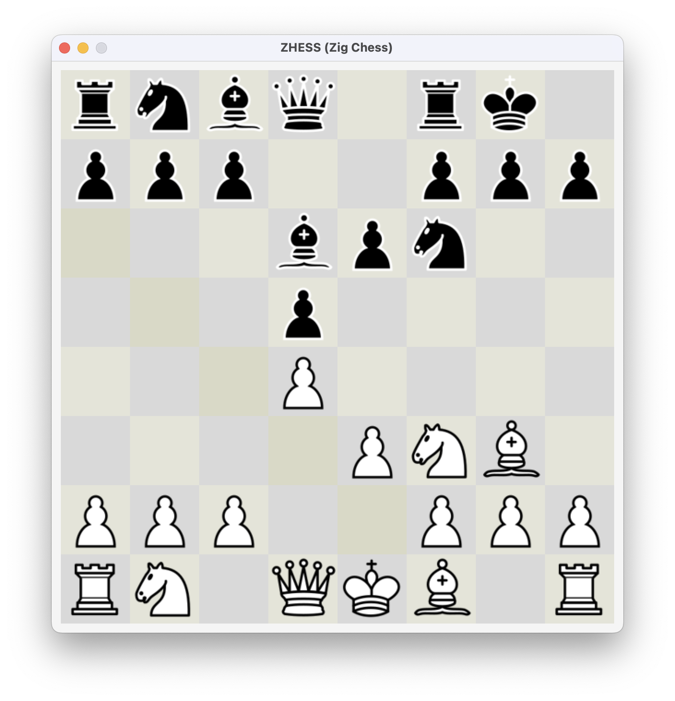

# ZCHESS

Small no frills chess game written in zig.
The game supports the usual chess rules including castling, pawn promotion and en passant.
The game does not contain any menu or settings. Instead running the binary starts a game. Upon checkmate the game can be closed and restarted for a new game.

---


---

## Building and Running

In order to build the game first the dependencies have to be installed. (See Section [Dependencies](#dependencies)).
Afterward the following command builds the game:
```
$ zig build
```
And the binary can be found in and run with:
```
$ ./zig-out/bin/zhess
```

## Dependencies

### Raylib

git@github.com:raysan5/raylib.git

Building
```
cd external/raylib/src
make
```

## Known Issues
 - No game over screen
 - Pawn promotion only to queen
